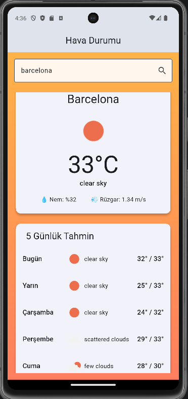

# Flutter Hava Durumu Uygulaması

OpenWeatherMap API kullanan, şehir bazlı anlık hava durumu ve 5 günlük tahmin sunan bir Flutter uygulaması.

## Özellikler

- **Anlık hava durumu** — Sıcaklık, nem, rüzgar hızı ve hava açıklaması
- **5 günlük tahmin** — Günlük min/max sıcaklık, ikon ve açıklama listesi
- **Dinamik arkaplan** — Hava durumuna göre değişen renk gradyanı (güneşli, bulutlu, yağmurlu vb.)
- **Hava durumu ikonları** — OpenWeatherMap ikonları; yüklenemezse Material ikon yedeklemesi

## Ekran görüntüsü

Barcelona için anlık hava durumu, dinamik turuncu gradyan arkaplan ve 5 günlük tahmin listesi:

<p align="center">
  
</p>

## Teknolojiler

| Alan | Kullanılan |
|------|------------|
| Framework | Flutter (Dart ^3.12) |
| HTTP istemcisi | `http` |
| Veri kaynağı | [OpenWeatherMap API](https://openweathermap.org/api) |

## Proje yapısı

```
lib/
├── main.dart                 # Uygulama giriş noktası
├── models/
│   ├── weather_model.dart    # Anlık hava verisi modeli
│   └── forecast_model.dart   # Günlük tahmin modeli
├── services/
│   └── weather_service.dart  # API istekleri
├── screens/
│   └── home_screen.dart      # Ana ekran (arama, kart, tahmin listesi)
└── widgets/
    └── weather_icon.dart     # Hava durumu ikonu widget'ı
```

## Gereksinimler

- [Flutter SDK](https://docs.flutter.dev/get-started/install) (3.x veya üzeri)
- OpenWeatherMap hesabı ve API anahtarı ([ücretsiz kayıt](https://home.openweathermap.org/users/sign_up))

## Kurulum

1. Depoyu klonlayın:

```bash
git clone <repo-url>
cd flutter_weather_app
```

2. Bağımlılıkları yükleyin:

```bash
flutter pub get
```

3. API anahtarınızı `lib/services/weather_service.dart` dosyasındaki `apiKey` sabitine ekleyin:

```dart
static const String apiKey = 'BURAYA_API_ANAHTARINIZ';
```

> API anahtarınızı herkese açık depolara commit etmeyin. Üretim için ortam değişkeni veya `--dart-define` kullanmanız önerilir.

## Çalıştırma

```bash
flutter run
```

Belirli bir cihazda çalıştırmak için:

```bash
flutter devices
flutter run -d <cihaz_id>
```

## Kullanılan API uç noktaları

| Endpoint | Açıklama |
|----------|----------|
| `GET /data/2.5/weather` | Anlık hava durumu |
| `GET /data/2.5/forecast` | 5 günlük tahmin (3 saatlik aralıklar) |

Her iki istek de `units=metric` ile Celsius cinsinden veri döndürür.

## Nasıl çalışır?

1. Kullanıcı şehir adı girer ve arar.
2. Uygulama anlık hava ve tahmin verisini **paralel** olarak çeker.
3. Forecast API'den gelen 3 saatlik kayıtlar günlere gruplanır; her gün için min/max sıcaklık hesaplanır.
4. Anlık hava durumuna göre arkaplan gradyanı animasyonlu şekilde güncellenir.


